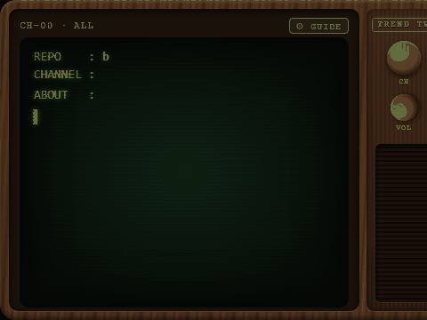

# Trend TV

A tiny CRT-TV desktop companion that lives in the corner of your screen and
types out trending GitHub repos — like watching a retro terminal channel
while you vibe code.



## Features (v0.1)

- **Old-TV typing display** — repo name, channel/category, description typed
  character-by-character on a phosphor CRT with scanlines, chromatic glow,
  and flicker. Holds 5 s after typing so you can read it, then glitches to
  the next card.
- **Channels** — hover the ⚙ gear (top-right) to open the TV Guide and switch
  channels: ALL / Production / Visual / Audio / DevTools / Games, with a
  static-burst channel-change animation. Categories are keyword-classified
  from each repo's language and description.
- **TV appearances** — six body styles: Slim bezel, Woody 70s (wood-grain
  with knobs), Cartoon (chunky pastel plastic + bubble buttons), Cyberdeck
  (gunmetal + neon trim), Pixel (handheld-gray + purple buttons), Space Age
  (60s white shell + orange trim) — most with working CH/VOL knobs —
  × seven screen themes: Green CRT, Amber, VHS Blue, B&W 1950s, Sakura
  (cute cartoon — swaps to a rounded comic font), Cyber Neon, Game Boy.
- **Hold time** — choose how long a finished card stays on screen before
  the next one: 2 / 5 / 10 / 15 / 20 seconds (default 5 s).
- **CRT sound pack** — fully synthesized with WebAudio (no audio files):
  power-on hum + tube crackle, per-character typing clacks, static bursts
  on channel switches, degauss wobble on hover, mechanical knob clicks.
  **Volume defaults to Low (barely audible)** and can be set Off/Low/Med/High
  in the TV Guide or by clicking the VOL knob. A constant whisper-level
  50 Hz tube hum runs underneath once audio is unlocked.
- **Click a card** to open the repo on GitHub.
- **Resilient feed** — the Rust backend scrapes `github.com/trending`
  (daily + weekly, merged & deduped) every 3 h into a local JSON cache.
  The display never depends on a live fetch: on failure it keeps serving
  the cache; if the signal has been lost for >24 h the app shows a
  "PLEASE STAND BY" test card while playing reruns from cache. A bundled
  snapshot means even a first offline launch has content.
- **No-repeat shuffle** — each channel plays through a shuffled bag before
  reshuffling, with a 200-item seen-history so fresh repos come first.

## Run it

```sh
npm install

# browser preview (uses bundled snapshot data)
npm run dev

# desktop app (dev mode, connects to the dev server)
npm run tauri dev

# production build (installer in src-tauri/target/release/bundle)
npm run tauri build
```

## Stack

Tauri v2 (Rust backend: reqwest + scraper fetcher, local JSON cache) +
vanilla JS/CSS frontend (Vite). No server, no API keys, no tracking.

## Roadmap (Steam "deluxe" tier ideas)

Theme/skin packs, CRT sound pack, more feeds (Hacker News, Product Hunt),
Steam Workshop themes, achievements, auto-updates.
